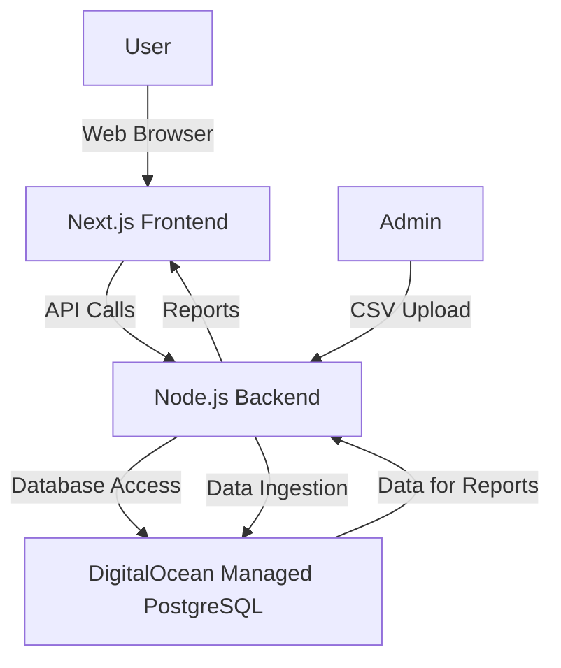

### Introduction

This document outlines the complete fullstack architecture for **Internal Affiliate Dashboard**, including backend systems, frontend implementation, and their integration. It serves as the single source of truth for AI-driven development, ensuring consistency across the entire technology stack.

This unified approach combines what would traditionally be separate backend and frontend architecture documents, streamlining the development process for modern fullstack applications where these concerns are increasingly intertwined.

#### Starter Template or Existing Project

N/A - Greenfield project

#### Change Log

| Date | Version | Description | Author |
| :--- | :------ | :---------- | :----- |
| | | | |

### High Level Architecture

#### Technical Summary

The Internal Affiliate Dashboard will be developed as a monolithic fullstack application, leveraging Next.js 15 for the frontend and a Node.js/Express backend, all deployed on DigitalOcean's App Platform and Managed PostgreSQL Database. Communication between frontend and backend will occur directly within this unified application. This architecture is chosen for rapid MVP delivery within a two-week timeline, enabling self-service reporting for affiliates by providing secure authentication, CSV data ingestion with deduplication, and programmatic report generation, starting with a Cohort Report.

#### Platform and Infrastructure Choice

**Platform:** DigitalOcean App Platform
**Key Services:** DigitalOcean App Platform (application hosting), DigitalOcean Managed Database (PostgreSQL)
**Deployment Host and Regions:** DigitalOcean (specific regions not defined, will default to a suitable region for performance and availability).

#### Repository Structure

**Structure:** Monorepo
**Monorepo Tool:** Not explicitly specified, but implied by the choice of Next.js and the need for shared code. Will assume standard npm/yarn workspaces or a lightweight tool like Turborepo if needed.
**Package Organization:** Will contain `apps/web` for the Next.js frontend, `apps/api` for the backend, and `packages/shared` for shared types and utilities.

#### High Level Architecture Diagram

#### Architectural Patterns

-   **Monolithic Architecture:** The application will initially be developed as a single, tightly coupled codebase for faster iteration and simplified deployment for the MVP.
-   **Component-Based UI:** The frontend will utilize reusable Shadcn UI components for consistency and maintainability.
-   **Role-Based Access Control (RBAC):** Secure authentication and authorization will be implemented to restrict access based on user roles (admin/user).

### Technology Stack Summary

The project leverages a modern fullstack JavaScript/TypeScript ecosystem. The frontend is built with **Next.js 15** and **Shadcn UI**, utilizing **React Server Components**. The backend is integrated within Next.js using **API Routes** and **Server Actions**, interacting with a **PostgreSQL** database via **Prisma/Drizzle ORM**. Authentication is handled by `better-auth`. Development tools include **Jest** and **Playwright** for testing, and **GitHub Actions** for CI/CD, with deployment to **DigitalOcean App Platform**.

---

**For detailed information on specific architectural aspects, please refer to:**

*   [Coding Standards](coding-standards.md)
*   [Source Tree Structure](source-tree.md)
*   [Technology Stack Details](tech-stack.md)