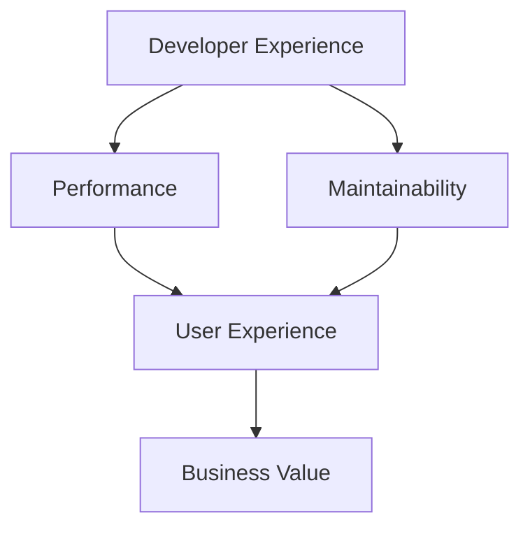
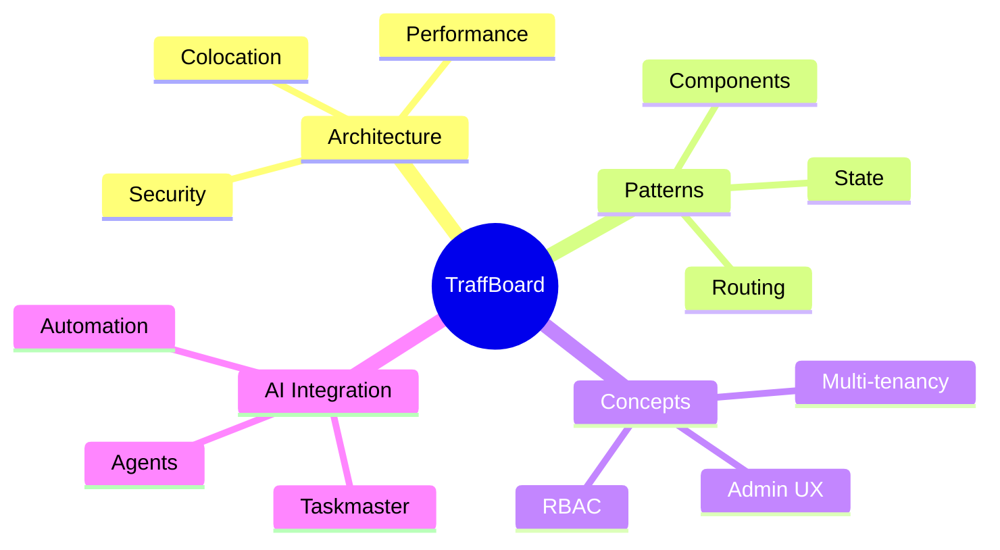

# 🧠 Explanation

> **Understanding-oriented documentation** that explains the context, design decisions, and concepts behind TraffBoard

This section provides the background knowledge and conceptual understanding needed to work effectively with TraffBoard. Here you'll find the "why" behind our design decisions and architectural choices.

## 🎯 **When to Read Explanations**

- ✅ You want to **understand the reasoning** behind design decisions
- ✅ You need **architectural context** for contributing or extending
- ✅ You're curious about **best practices** and patterns used
- ✅ You want to **avoid common pitfalls** and anti-patterns

## 📚 **Understanding Categories**

### **🏗️ [Architecture](architecture/)**
Deep dive into TraffBoard's technical architecture:

- **[Architecture Overview](architecture/overview.md)** - High-level system design
- **[Colocation Pattern](architecture/colocation.md)** - Why we organize code this way
- **[Design Decisions](architecture/design-decisions.md)** - Key architectural choices
- **[Data Flow](architecture/data-flow.md)** - How data moves through the system
- **[Security Architecture](architecture/security.md)** - Security considerations and design
- **[Scalability Design](architecture/scalability.md)** - How TraffBoard scales

---

### **🎨 [Design Patterns](patterns/)**
Common patterns and practices used throughout TraffBoard:

- **[State Management](patterns/state-management.md)** - How we handle application state
- **[Routing Patterns](patterns/routing.md)** - Navigation and URL structure
- **[Styling Patterns](patterns/styling.md)** - CSS and theming approaches
- **[Component Patterns](patterns/components.md)** - Reusable component design
- **[Error Handling](patterns/error-handling.md)** - Robust error management
- **[Testing Patterns](patterns/testing.md)** - Testing strategies and approaches

---

### **💡 [Core Concepts](concepts/)**
Fundamental concepts that drive TraffBoard's design:

- **[Admin Dashboards](concepts/admin-dashboards.md)** - What makes a great admin interface
- **[Multi-tenancy](concepts/multi-tenancy.md)** - Supporting multiple organizations
- **[Role-Based Access Control](concepts/rbac.md)** - Permissions and authorization
- **[Performance Philosophy](concepts/performance.md)** - Speed and optimization principles
- **[Developer Experience](concepts/developer-experience.md)** - Making development enjoyable
- **[AI Integration Philosophy](concepts/ai-integration.md)** - Human-AI collaboration

## 🔍 **Key Insights**

### **🎯 Design Philosophy**


**Core Principles:**
- **Developer Experience First** - Happy developers build better products
- **Performance by Default** - Speed is a feature, not an afterthought
- **Maintainable Complexity** - Simple solutions for complex problems
- **AI-Enhanced Productivity** - Technology amplifying human capabilities

### **🏗️ Architectural Decisions**

| Decision | Reasoning | Trade-offs |
|----------|-----------|------------|
| **Next.js App Router** | Modern React patterns, better performance | Learning curve for Pages Router users |
| **Colocation Architecture** | Easier maintenance, clear boundaries | Deeper directory structure |
| **TypeScript First** | Type safety, better DX | Initial setup complexity |
| **Tailwind CSS v4** | Utility-first, performance | CSS-in-JS not available |
| **Shadcn UI** | High quality, customizable | Less control over base components |

### **🎨 Pattern Examples**

#### **State Management Pattern**
```typescript
// Zustand store pattern
interface DashboardStore {
  data: DashboardData | null;
  loading: boolean;
  error: string | null;
  
  fetchData: () => Promise<void>;
  updateData: (data: Partial<DashboardData>) => void;
  reset: () => void;
}

// Why this pattern?
// - Simple and predictable
// - TypeScript-friendly
// - No boilerplate
// - Easy to test
```

#### **Component Composition Pattern**
```typescript
// Flexible component composition
<Card>
  <CardHeader>
    <CardTitle>Dashboard Stats</CardTitle>
  </CardHeader>
  <CardContent>
    <MetricGrid data={metrics} />
  </CardContent>
</Card>

// Why this pattern?
// - Flexible composition
// - Clear hierarchy
// - Reusable components
// - Accessible by default
```

## 🧭 **Conceptual Map**

### **🎯 How Concepts Connect**


### **📚 Reading Path by Role**

#### **👨‍💼 Product Managers**
1. [Admin Dashboard Concepts](concepts/admin-dashboards.md)
2. [Multi-tenancy](concepts/multi-tenancy.md)
3. [Performance Philosophy](concepts/performance.md)

#### **👨‍💻 Frontend Developers**
1. [Architecture Overview](architecture/overview.md)
2. [Component Patterns](patterns/components.md)
3. [State Management](patterns/state-management.md)
4. [Styling Patterns](patterns/styling.md)

#### **🏗️ System Architects**
1. [Architecture Overview](architecture/overview.md)
2. [Design Decisions](architecture/design-decisions.md)
3. [Scalability Design](architecture/scalability.md)
4. [Security Architecture](architecture/security.md)

#### **🤖 AI/Automation Engineers**
1. [AI Integration Philosophy](concepts/ai-integration.md)
2. [Colocation Pattern](architecture/colocation.md)
3. [Developer Experience](concepts/developer-experience.md)

## 🔬 **Deep Dive Topics**

### **🚀 Performance Insights**
- **Why colocation improves performance** - Reduced bundle splitting
- **How Tailwind v4 affects build times** - Compile-time optimizations
- **Next.js 15 App Router benefits** - Streaming and partial prerendering

### **🔒 Security Considerations**
- **Why we chose certain auth patterns** - Balance of security and usability
- **How RBAC scales across tenants** - Permission inheritance patterns
- **Why TypeScript helps with security** - Compile-time safety checks

### **🎨 Design System Thinking**
- **Component abstraction levels** - When to abstract, when not to
- **Theme system architecture** - CSS custom properties vs Tailwind
- **Responsive design philosophy** - Mobile-first with progressive enhancement

## 🔄 **Related Documentation**

### **For Implementation**
- **[How-To Guides](../how-to/)** - Apply these concepts practically
- **[Tutorials](../tutorial/)** - Learn through hands-on practice
- **[Reference](../reference/)** - Look up specific implementation details

### **For Getting Started**
- **[Getting Started Tutorial](../tutorial/getting-started.md)** - Your first TraffBoard setup
- **[Development Setup](../how-to/development/setup-dev-env.md)** - Configure your environment

## 📖 **Reading Tips**

### **📚 How to Read Explanations**
- **Don't rush** - These concepts build on each other
- **Take notes** - Complex ideas are easier to remember when written down
- **Ask questions** - Use our discussions to clarify concepts
- **Apply knowledge** - Try implementing the patterns you learn about

### **🎯 Focus Areas by Experience**

#### **🌱 New to TraffBoard**
Start with:
1. [Architecture Overview](architecture/overview.md)
2. [Admin Dashboard Concepts](concepts/admin-dashboards.md)
3. [Developer Experience](concepts/developer-experience.md)

#### **🔄 Migrating from Other Frameworks**
Focus on:
1. [Design Decisions](architecture/design-decisions.md)
2. [State Management Patterns](patterns/state-management.md)
3. [Colocation Pattern](architecture/colocation.md)

#### **⚡ Performance-Focused**
Read:
1. [Performance Philosophy](concepts/performance.md)
2. [Architecture Overview](architecture/overview.md)
3. [Scalability Design](architecture/scalability.md)

## 💭 **Philosophy & Vision**

### **🎯 Our Core Beliefs**
- **Complexity should be managed, not eliminated** - Real applications are complex
- **Developer experience drives product quality** - Happy developers ship better code
- **AI should augment, not replace human creativity** - Technology as a force multiplier
- **Patterns should emerge from practice** - Solutions first, abstractions second

### **🔮 Future Directions**
Understanding our current architecture helps you:
- **Contribute effectively** - Know why things are designed this way
- **Extend confidently** - Build on solid foundations
- **Avoid pitfalls** - Learn from our experiences and decisions

---

> **🧠 Ready to dive deeper?** Start with [Architecture Overview](architecture/overview.md) to understand how everything fits together! 