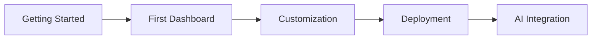

# Tutorial - Learning TraffBoard

Step-by-step guides to learn TraffBoard development from basics to advanced topics.

## Getting Started

### Essential Tutorials
- **[Getting Started](getting-started.md)** - Set up TraffBoard locally in 15 minutes

### Coming Soon
- **Development Workflow** - Daily development cycle with TraffBoard
- **Customization Basics** - Modify themes, components, and layouts
- **Deployment Tutorial** - Deploy to DigitalOcean App Platform
- **AI Integration** - Set up Cursor and Taskmaster for AI-assisted development

## Learning Path

### 🌱 Beginner (New to TraffBoard)
1. [Getting Started](getting-started.md) - Local setup and first run
2. Development Workflow - Learn the dev cycle *(coming soon)*
3. Customization Basics - Make it yours *(coming soon)*

### 🚀 Intermediate (Building Features)
1. AI Integration - Cursor and Taskmaster setup *(coming soon)*
2. Component Development - Build new UI components *(coming soon)*
3. API Integration - Connect external services *(coming soon)*

### ⚡ Advanced (Production Ready)
1. Deployment Tutorial - Production deployment *(coming soon)*
2. Performance Optimization - Speed up your app *(coming soon)*
3. Security Configuration - Protect your data *(coming soon)*

---

**Next Step**: [Start with Getting Started →](getting-started.md)

## 🎯 **What You'll Learn**

Our tutorials are designed to build your confidence and understanding through **practical, step-by-step exercises**. Each tutorial is self-contained but builds upon previous knowledge.

### **📚 Tutorial Path**

## 📖 **Available Tutorials**

### **🚀 [Getting Started](getting-started.md)**
*15-20 minutes*

Your first steps with TraffBoard. Learn to:
- ✅ Install and configure TraffBoard
- ✅ Understand the project structure  
- ✅ Run your first local development server
- ✅ Navigate the admin interface

**Prerequisites**: Node.js 18+, Git, Code editor

---

### **🎨 [Build Your First Dashboard](first-dashboard.md)**
*30-45 minutes*

Create a functional admin dashboard from scratch:
- ✅ Add new pages and routes
- ✅ Create custom components
- ✅ Implement data visualization
- ✅ Add user interactions

**Prerequisites**: Complete "Getting Started" tutorial

---

### **🎭 [Customizing Your Dashboard](customization.md)**
*25-35 minutes*

Make TraffBoard your own:
- ✅ Customize themes and styling
- ✅ Configure navigation and layout
- ✅ Add your own UI components
- ✅ Implement responsive design

**Prerequisites**: Complete "First Dashboard" tutorial

---

### **🚀 [Deploy to Production](deployment.md)**
*20-30 minutes*

Get your dashboard live:
- ✅ Prepare for production build
- ✅ Configure environment variables
- ✅ Deploy to Vercel/Netlify
- ✅ Set up monitoring and analytics

**Prerequisites**: Complete previous tutorials

---

### **🤖 [AI Integration Setup](ai-integration.md)**
*40-60 minutes*

Supercharge your workflow with AI:
- ✅ Configure Taskmaster AI
- ✅ Set up AI agents for development
- ✅ Automate documentation generation
- ✅ Implement smart code suggestions

**Prerequisites**: Complete "Deployment" tutorial

## 🛠️ **Tutorial Requirements**

### **System Requirements**
- **Node.js**: 18.0.0 or higher
- **Package Manager**: pnpm (recommended) or npm  
- **Git**: Latest version
- **Code Editor**: VS Code (recommended)

### **Recommended VS Code Extensions**
- ES7+ React/Redux/React-Native snippets
- Tailwind CSS IntelliSense
- TypeScript Importer
- Prettier - Code formatter
- GitLens

### **Knowledge Prerequisites**
- **Basic JavaScript/TypeScript** (variables, functions, modules)
- **React fundamentals** (components, props, state)
- **HTML/CSS basics** (selectors, flexbox, grid)
- **Command line basics** (cd, ls, npm commands)

## 💡 **Tutorial Tips**

### **📝 Before You Start**
1. **Set aside uninterrupted time** - Each tutorial has estimated duration
2. **Have your development environment ready** - Code editor, terminal, browser
3. **Follow along actively** - Type the code yourself, don't just copy-paste
4. **Experiment** - Try variations and see what happens

### **🐛 If You Get Stuck**
1. **Check the Prerequisites** - Ensure you have all required tools and knowledge
2. **Review Previous Steps** - Make sure you didn't miss anything
3. **Check our FAQ** - Common issues and solutions
4. **Ask for Help** - [GitHub Discussions](https://github.com/AlexTsimba/traffboard/discussions)

### **📈 Level Up Your Learning**
- **Take breaks** - Learning is more effective with regular breaks
- **Practice variations** - Try modifying the examples
- **Share your progress** - Tweet your screenshots with `#TraffBoard`
- **Help others** - Answer questions in our community

## 🎯 **Learning Outcomes**

After completing all tutorials, you'll be able to:

- ✅ **Set up** a TraffBoard project from scratch
- ✅ **Build** custom admin dashboards with modern React patterns
- ✅ **Customize** themes, layouts, and components
- ✅ **Deploy** production-ready applications
- ✅ **Integrate** AI tools for enhanced productivity
- ✅ **Troubleshoot** common issues independently
- ✅ **Extend** TraffBoard for your specific needs

## 🔄 **What's Next?**

### **After Tutorials**
Once you've completed the tutorials, explore:

- **[How-To Guides](../how-to/)** - Solve specific problems
- **[Reference Documentation](../reference/)** - Detailed API and configuration docs
- **[Architecture Guide](../explanation/)** - Understand the deeper concepts

### **Join the Community**
- 💬 [GitHub Discussions](https://github.com/AlexTsimba/traffboard/discussions)
- 🐛 [Report Issues](https://github.com/AlexTsimba/traffboard/issues)
- 🌟 [Star the Repository](https://github.com/AlexTsimba/traffboard)

---

> **🎓 Ready to start learning?** Begin with [Getting Started](getting-started.md) to set up your first TraffBoard project! 